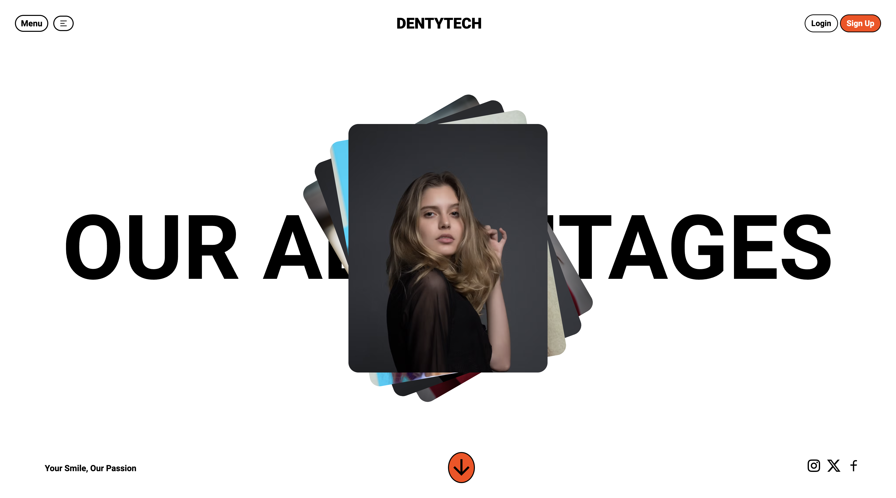

# 🦷✨ Dental Site Frontend Magic ✨🪄

Welcome to my dental site frontend design repository! Dive into the world of frontend enchantment as I wield HTML and CSS to craft a captivating dental website. Inspired by the mystical designs of Dribbble, join me on a journey of discovery and improvement as I strive to uplift my frontend skills to new heights!

## 🎨 Preview

## 🌟 Key Features

- **HTML & CSS Sorcery:** Witness the magic of HTML and CSS as they come together to create stunning web layouts.
- **Inspiration from Dribbble:** Drawing inspiration from the enchanting designs of Dribbble, experience the beauty of frontend creativity.
- **Responsive Wizardry:** Explore a design that seamlessly adapts across various devices, casting spells of responsiveness.
- **Continuous Improvement:** Embark on a quest of relentless improvement as I refine the frontend enchantments to perfection.
- **Open for Collaboration:** Join forces with fellow wizards and witches to brew potions of creativity and weave spells of frontend brilliance.

## 🪄 Next Steps

- **Polish & Shine:** Refine the enchantments to dazzle users with a spellbinding user experience.
- **Accessibility Enchantment:** Craft spells of inclusivity, ensuring that all users can partake in the magic.
- **Integration Wizardry:** Infuse the design with dynamic features using JavaScript sorcery, adding layers of interactivity.
- **Community Conjure:** Summon the fellowship of developers to share knowledge, exchange spells, and embark on epic quests of frontend mastery.

## 🌟 Join the Magic!

Embark on this magical journey with me as we conjure captivating frontend designs and weave webs of digital enchantment! Join the adventure today by exploring the code and contributing to the magic! ✨🔮🌟
